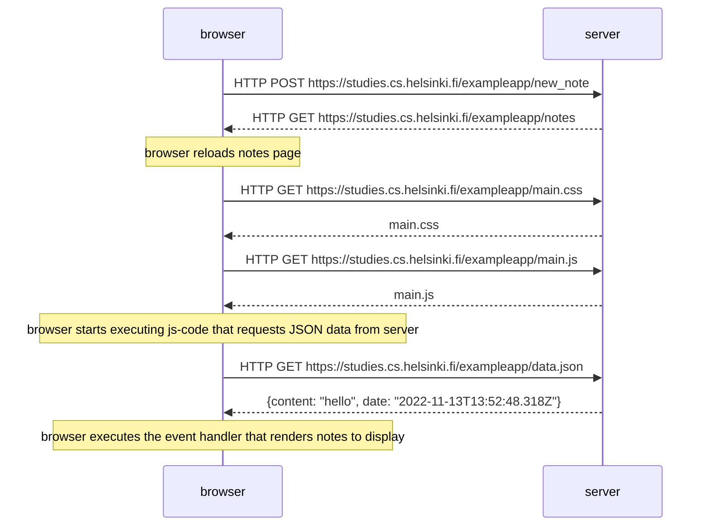

```mermaid
  sequenceDiagram
    browser->>server: HTTP POST https://studies.cs.helsinki.fi/exampleapp/new_note
    server-->>browser: HTTP GET https://studies.cs.helsinki.fi/exampleapp/notes
    note over browser: browser reloads notes page
    browser->>server: HTTP GET https://studies.cs.helsinki.fi/exampleapp/main.css
    server-->>browser:  main.css
    browser->>server: HTTP GET https://studies.cs.helsinki.fi/exampleapp/main.js
    server-->>browser: main.js
    note over browser: browser starts executing js-code that requests JSON data from server
    browser->>server: HTTP GET https://studies.cs.helsinki.fi/exampleapp/data.json
    server-->>browser: {content: "hello", date: "2022-11-13T13:52:48.318Z"}
    note over browser: browser executes the event handler that renders notes to display
```
